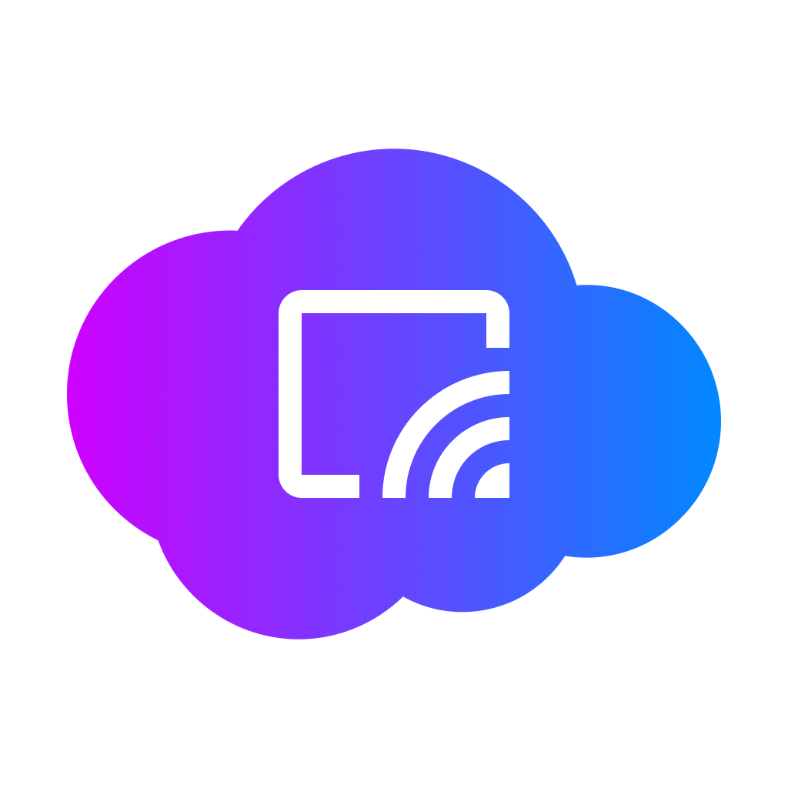
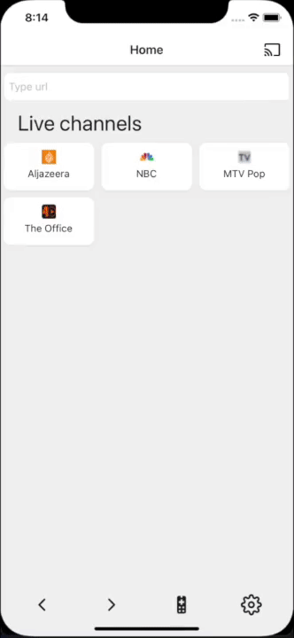
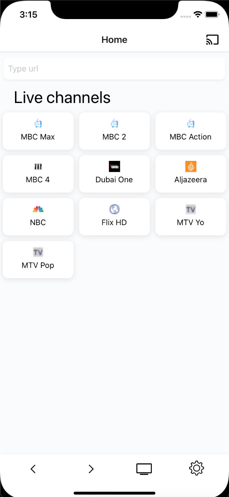
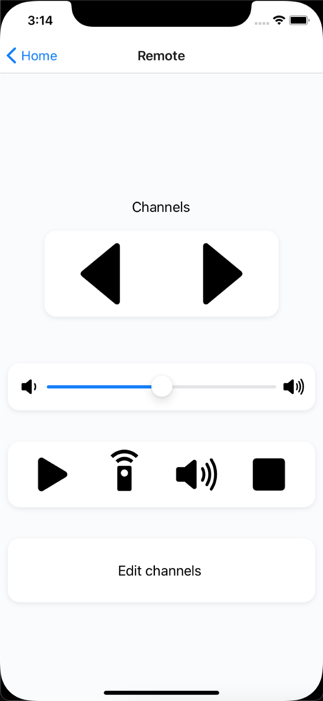

<h1> 
React Native Chromecast Application</h1>
 
 

React-native chromecast application with tv-remote functionality, typically best for watching live tv with the functionality to add, remove and edit different live channels.

Integrated [React Native Webview](https://github.com/react-native-webview) as a build in browser for browsing and adding other channels.

## Libraries

[Google Cast Library](https://www.github.com/react-native-google-cast)

Used react native google cast library in bareflow to integrate casiting with chromecast.

## Framework

[React Native](https://www.reactnative.dev)

<!--  -->

